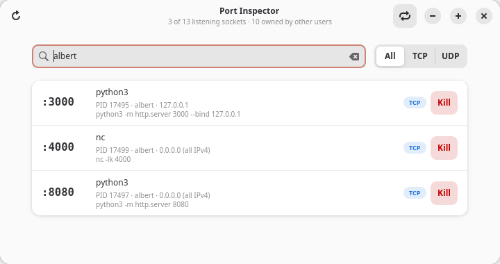

<p align="center">
  
</p>

# Porthole

See what's listening on your ports and kill it in one click. A small native GTK4 + libadwaita app for Linux.



## Features

- Lists every listening TCP and UDP port, with the process, PID, user and command
- Filter by port, process name, PID or user
- Terminate or force kill a process, with admin rights if needed
- Refreshes automatically

## Installation

For now you need to build it from source. Ready-made packages are coming soon.

### Install from package

Coming soon...

### Build from source

#### 1. Install dependencies

You need Rust (1.85 or newer, get it from [rustup.rs](https://rustup.rs)) and the GTK4 and libadwaita development files.

Ubuntu / Debian:

```sh
sudo apt install build-essential pkg-config libgtk-4-dev libadwaita-1-dev
```

Fedora:

```sh
sudo dnf install gcc pkgconf-pkg-config gtk4-devel libadwaita-devel
```

Arch:

```sh
sudo pacman -S base-devel gtk4 libadwaita
```

GTK 4.12+ and libadwaita 1.7+ are required.

#### 2. Build and run

```sh
git clone https://github.com/AlbertArakelyan/Porthole.git
cd Porthole
cargo run --release
```

The binary ends up in `target/release/porthole`. Copy it anywhere on your `PATH` if you want to run it directly.

## Good to know

Linux only shows you details of your own processes. Ports opened by root or system services show up as "Unknown process". Run the app with `sudo` if you want to see those too.
